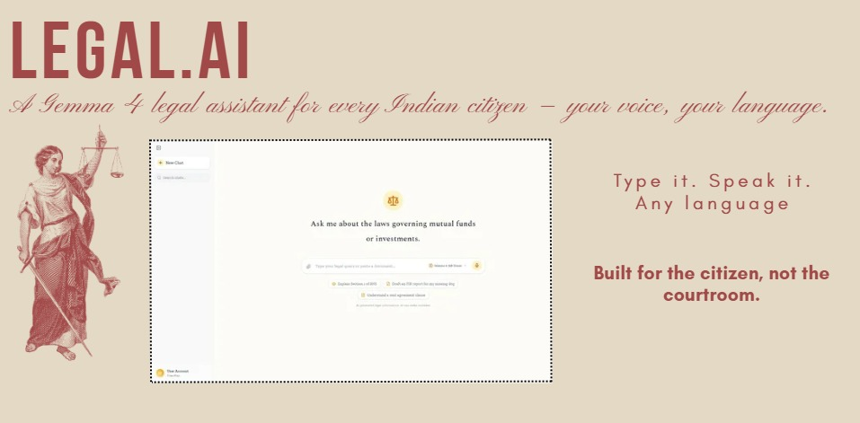
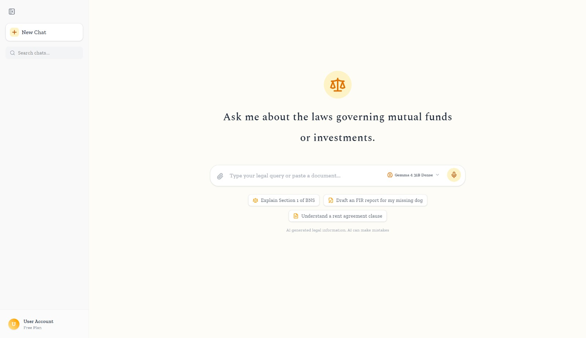
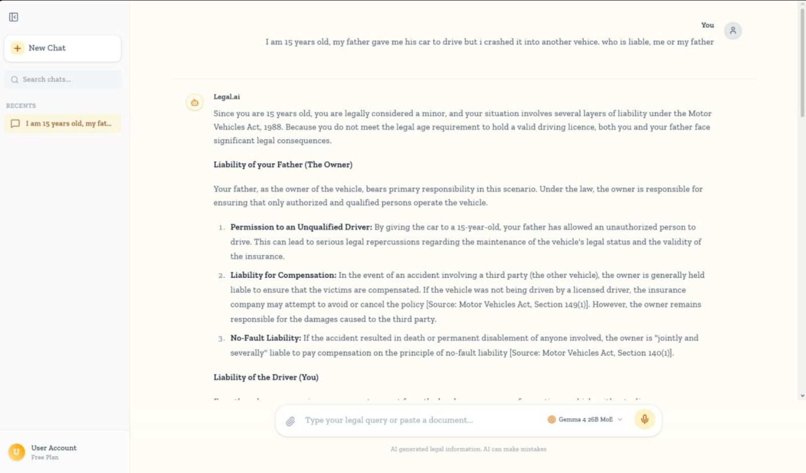
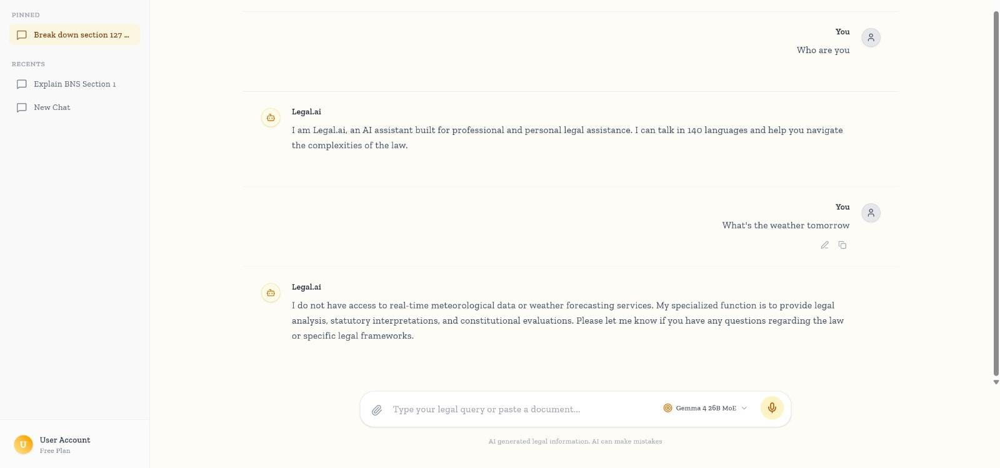
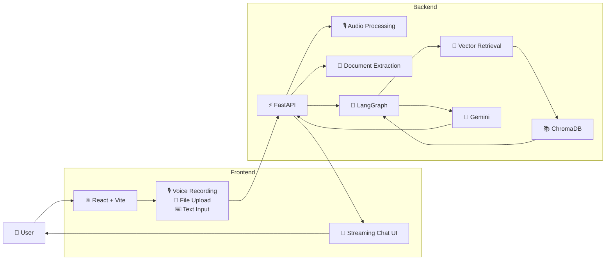
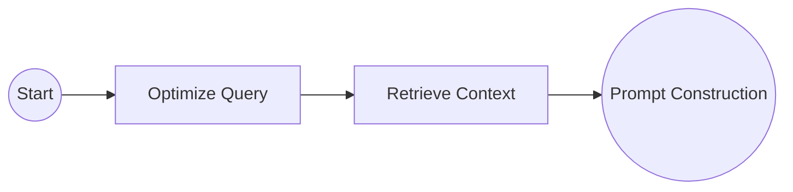

<div align="center">



# ⚖️ Legal.ai

### The AI Bridge to Legal understanding

#### A multilingual AI legal assistant that helps Indian citizens understand laws, legal documents, and procedural next steps through Retrieval-Augmented Generation (RAG).

<p>

[]()
[]()
[]()
[]()
[]()
[]()
[]()
[](LICENSE)
[](../../releases)

</p>

---

### 🚀 Built during a hackathon. Designed for real-world legal accessibility.

**🎙 Voice First • 📄 Document Understanding • ⚖️ Citation Grounding • 🌍 Multilingual • ⚡ Real-Time Streaming**

[Features](#-features) •
[Architecture](#-system-architecture) •
[Installation](#-installation) •
[Roadmap](#-roadmap) •
[Contributing](#-contributing)

</div>

---

# 📑 Table of Contents

- [Project Overview](#-project-overview)
- [Why Legal.AI?](#-why-legalai)
- [Demo](#-demo)
- [Screenshots](#-screenshots)
- [Core Features](#-core-features)
- [System Architecture](#-system-architecture)
- [Request Lifecycle](#-request-lifecycle)
- [AI Pipeline](#-ai-pipeline)
- [RAG Pipeline](#-rag-pipeline)
- [Voice & Document Processing](#-voice--document-processing)
- [Tech Stack](#-tech-stack)
- [Repository Structure](#-repository-structure)
- [Installation](#-installation)
- [Configuration](#-configuration)
- [Usage](#-usage)
- [Performance Optimizations](#-performance-optimizations)
- [Engineering Decisions](#-engineering-decisions)
- [Known Limitations](#-known-limitations)
- [Future Roadmap](#-future-roadmap)
- [Contributing](#-contributing)
- [License](#-license)
- [Acknowledgements](#-acknowledgements)

---

# 📖 Project Overview

Legal.ai is an open-source AI legal assistant designed to make Indian legal information more accessible to ordinary citizens.

Most legal information today is written for lawyers—not for the people expected to understand it. Laws are often drafted in dense legal English, filled with procedural terminology, and scattered across lengthy documents that can be intimidating even for educated readers. For many citizens, especially first-time complainants or individuals from multilingual backgrounds, simply understanding *where to begin* becomes a significant barrier.

Legal.ai approaches this problem from a citizen-first perspective.

Instead of expecting users to know legal terminology, the system allows them to describe their situation naturally through text, voice, or uploaded legal documents. The backend retrieves relevant legal context from an indexed corpus of Indian legal statutes before generating a response, allowing the model to provide explanations that are grounded in retrieved legal material rather than relying solely on parametric knowledge.

The project combines modern AI engineering techniques—including Retrieval-Augmented Generation (RAG), LangGraph orchestration, semantic vector search, document processing, and real-time streaming—to create an experience that feels conversational while remaining grounded in legal source material.

Originally developed during a hackathon, the project has since evolved into a modular React + FastAPI architecture intended for further experimentation, research, and open-source collaboration.

---

# ❓ Why Legal.ai?

Large Language Models are excellent at explaining information—but legal domains require more than fluent language generation.

Legal responses must remain contextual, explain procedural next steps, and reference actual legal material wherever possible. A generic chatbot may produce convincing answers while lacking the factual grounding expected from legal information systems.

Legal.ai therefore follows a **retrieval-first** architecture.

Instead of directly asking an LLM to answer legal questions, the application:

- retrieves relevant legal sections from a vector database,
- injects those sections into the prompt,
- instructs the model to reason over retrieved context,
- streams the generated answer back to the user in real time.

This design significantly improves transparency while keeping the interaction conversational and intuitive.

The goal is **not to replace legal professionals.**

The goal is to reduce confusion, improve accessibility, and help citizens understand legal concepts before they seek formal legal assistance.

---

# 🎥 Demo

A complete walkthrough of Legal.AI demonstrating:

- Natural language conversations
- Multilingual support
- Retrieval-Augmented Generation
- Streaming responses
- Citation-backed legal reasoning

▶️ **Watch the Demo**

https://drive.google.com/drive/folders/1u6bkxvxysHJYJLXOERrsYkN5ycsKLfa8?usp=drive_link

> **Note**
>
> The demo focuses primarily on conversational capabilities and streaming responses. Voice interaction and document upload are not demonstrated separately within the project media gallery but remain fully supported by the application.

---

# 📸 Screenshots

## 🏠 Welcome Screen

<p align="center">
  
</p>

The landing interface allows users to begin conversations immediately through text or voice while highlighting the application's multilingual capabilities.

---

## 💬 Example Legal Conversation

<p align="center">
  
</p>

A retrieval-grounded response generated using indexed legal documents, complete with structured reasoning and statutory references.

---

## 🛡 Identity & Legal Guardrails

<p align="center">
  
</p>

The assistant is intentionally restricted to legal assistance and politely refuses unrelated requests while maintaining its identity and intended purpose.

# ✨ Core Features

## 👤 Citizen Experience

| Feature | Description |
|----------|-------------|
| 💬 Natural Language Conversations | Ask legal questions using everyday language instead of legal terminology. |
| 🎙 Voice-First Interaction | Record voice directly from the browser and automatically transcribe it using Gemini Flash. |
| 📄 Document Understanding | Upload legal notices, PDFs, or text documents and receive simplified explanations. |
| 🌍 Multilingual Friendly | Designed for English, Hindi, Hinglish, and regional-language interactions. |
| ⚡ Real-Time Responses | Stream model outputs token-by-token for an interactive experience. |
| 🔊 Read Aloud | Listen to responses using the browser's native SpeechSynthesis engine. |

---

## 🤖 AI Capabilities

| Capability | Description |
|------------|-------------|
| Retrieval-Augmented Generation | Responses are grounded using retrieved legal context rather than relying solely on the language model. |
| LangGraph Orchestration | A modular workflow separates query optimization, retrieval, and response generation. |
| Semantic Vector Search | ChromaDB retrieves context using dense embeddings instead of keyword matching. |
| Prompt-Engineered Legal Reasoning | The system encourages structured legal reasoning and citation-backed responses through carefully designed prompts. |
| Streaming Inference | Generated tokens are streamed immediately to the frontend using Server-Sent Events. |

---

## ⚙ Engineering Highlights

| Component | Description |
|-----------|-------------|
| React + FastAPI Architecture | Clean separation between frontend and backend responsibilities. |
| Browser-Native Speech | Uses browser APIs for speech synthesis without requiring additional backend infrastructure. |
| Google Gemini Flash STT | Audio transcription leverages Gemini's multimodal capabilities. |
| ChromaDB Vector Store | Local semantic search over indexed legal documents. |
| Async Backend | Long-running retrieval tasks are isolated from the FastAPI event loop to improve responsiveness. |
| Modular Services | AI orchestration, audio processing, ingestion, and API routing are separated into dedicated modules. |

---

# 📸 Screenshots

> **Screenshots will be added before the public release.**

| Screen | Description |
|---------|-------------|
| 🏠 Home Screen | Landing interface with chat input and quick actions. |
| 💬 Conversation | Interactive chat interface displaying streamed model responses. |
| ⚡ Streaming | Incremental token generation while the model is responding. |
| 📄 Document Upload | Upload legal notices and supporting documents for explanation. |
| 🔊 Voice Playback | Read generated responses aloud using browser-native TTS. |

---

# 🎥 Demo

A complete walkthrough demonstrating:

- Text-based conversations
- Voice interaction
- Document upload
- Live streaming responses
- Citation-backed legal explanations

will be linked here before the public release.

> **Demo:** *Coming Soon*

---

# 🌟 What Makes This Project Different?

Many legal AI projects stop at "chat with an LLM."

Legal.ai instead focuses on building a complete user experience around legal information retrieval.

Rather than treating retrieval as a secondary feature, it becomes the foundation of the application architecture.

Some of the engineering decisions that differentiate this project include:

- Retrieval before generation instead of generation-first prompting.
- Legislative-aware document chunking during vector database construction.
- Real-time Server-Sent Event streaming for responsive conversations.
- Browser-native speech synthesis to eliminate unnecessary backend infrastructure.
- Modular LangGraph orchestration separating retrieval from response generation.
- Dedicated document processing pipeline for uploaded legal material.
- Local semantic vector search using ChromaDB instead of traditional keyword matching.

Together, these components create a system that is significantly more transparent and extensible than a conventional chatbot interface.

---

# 🏗 System Architecture

Legal.ai follows a modular client-server architecture that separates user interaction, document processing, retrieval, and response generation into independent layers. Rather than treating the language model as a single black-box API call, the system organizes each stage of the request lifecycle into dedicated components that can evolve independently.



The architecture intentionally keeps responsibilities separated:

| Layer | Responsibility |
|--------|----------------|
| **Frontend** | User interaction, streaming UI updates, browser APIs |
| **FastAPI** | Request parsing, routing, multipart handling |
| **LangGraph** | Query orchestration and retrieval workflow |
| **Vector Database** | Semantic retrieval over indexed legal documents |
| **Gemma 4** | Grounded response generation |
| **Streaming Layer** | Incremental delivery of generated tokens |

This separation makes each component independently replaceable without affecting the rest of the application.

---

# 🔄 Complete Request Lifecycle

The following sequence illustrates what happens internally from the moment a user submits a query until a response appears on the screen.

## 1. User Interaction

The application accepts three different forms of input:

- Typed questions
- Voice recordings
- Uploaded documents

Regardless of the input modality, every request eventually becomes a single normalized text query before entering the retrieval pipeline.

---

## 2. Request Construction

The React frontend packages every request as a multipart payload containing:

- user message
- chat identifier
- selected model
- uploaded documents (optional)
- recorded audio (optional)

This unified request format allows the backend to process all interaction modes through a single endpoint.

---

## 3. Backend Processing

FastAPI receives the request and determines which preprocessing steps are required.

If an audio recording exists:

```
Audio
      │
      ▼
Gemini Flash
      │
      ▼
Transcript
```

If uploaded documents exist:

```
PDF / TXT
       │
       ▼
PyMuPDF
       │
       ▼
Extracted Text
```

These preprocessing steps occur before the AI workflow begins.

---

## 4. LangGraph Orchestration

Instead of directly calling the language model, the backend delegates processing to a LangGraph workflow.

The current workflow consists of two independent stages:

```text
User Query

↓

Query Optimization

↓

Semantic Retrieval

↓

Response Generation
```

Keeping retrieval separate from generation makes the pipeline significantly easier to extend in future versions.

Potential future additions—such as clarification agents, verification nodes, or reranking—can be inserted into the graph without redesigning the entire backend.

---

## 5. Query Optimization

Natural language rarely resembles legal language.

For example:

> "My landlord threw me out."

is unlikely to match legal documents directly.

Before retrieval, the query is rewritten into a denser legal search representation containing formal terminology and semantically related concepts.

This optimization improves retrieval quality without requiring the user to understand legal vocabulary.

---

## 6. Semantic Retrieval

The optimized query is embedded using Sentence Transformers and searched against the ChromaDB vector database.

Unlike keyword search, semantic retrieval allows conceptually similar legal sections to be discovered even when the wording differs.

Retrieved chunks are then formatted together with their associated metadata before being injected into the prompt.

Current retrieval includes metadata such as:

- Act
- Chapter
- Part
- Section

allowing the model to reference legal material more naturally.

---

## 7. Prompt Construction

The retrieved legal context is combined with:

- conversation history
- uploaded document text
- system instructions
- user query

to create a single grounded prompt for Gemini.

The prompt strongly encourages:

- structured legal reasoning
- citation-backed answers
- language consistency
- document prioritization when files are uploaded

Rather than relying solely on model memory, the language model reasons over retrieved legal material whenever possible.

---

## 8. Streaming Generation

Instead of waiting for the model to finish generating an entire response, Legal.ai streams tokens as soon as they become available.

```text
Gemma 4

↓

Chunk 1

↓

Chunk 2

↓

Chunk 3

↓

...

↓

Frontend
```

This significantly improves perceived responsiveness while also providing immediate visual feedback that the system is working.

Streaming is implemented using **Server-Sent Events (SSE)**.

---

## 9. Frontend Rendering

The frontend continuously reads incoming SSE chunks and appends them to the current message.

Instead of replacing the entire response repeatedly, only the newest text is added to the conversation.

This creates a ChatGPT-style streaming experience while keeping the interface responsive even for long responses.

---

# 🧠 LangGraph Workflow

LangGraph serves as the orchestration layer connecting retrieval with response generation.

The current workflow intentionally remains lightweight.



Each node performs one dedicated task.

| Node | Responsibility |
|------|----------------|
| Query Optimization | Rewrites natural language into legal search terminology |
| Retrieval | Retrieves semantically relevant legal context |
| Prompt Assembly | Combines retrieved context with user conversation before generation |

Although the current workflow is linear, the architecture is intentionally designed so additional nodes can be inserted later without changing surrounding components.

Examples include:

- clarification agents
- citation verification
- reranking
- confidence estimation
- procedural planning

---

# 📚 Retrieval-Augmented Generation Pipeline

The Retrieval-Augmented Generation pipeline is the core of Legal.ai.

Instead of asking the language model to answer questions from memory, the application retrieves relevant legal material before generation.


## Document Ingestion

Legal documents are processed offline before the application starts.

During ingestion:

- PDFs are parsed.
- Text is extracted.
- Legislative boundaries are preserved.
- Semantic chunks are created.
- Embeddings are generated.
- ChromaDB collections are populated.

Because the vector database is generated locally, repository size remains manageable while allowing contributors to rebuild the knowledge base from source documents.

---

## Chunking Strategy

Unlike generic chunking approaches that split documents every few hundred characters, Legal.AI attempts to preserve legislative structure.

During ingestion the parser tracks structural boundaries such as:

- Acts
- Chapters
- Parts
- Sections

before creating overlapping semantic chunks.

This reduces the likelihood of unrelated legal provisions appearing inside the same embedding.

---

## 📚 Default Knowledge Corpus

The repository includes an example legal corpus that was assembled specifically for the hackathon demonstration.

The default dataset contains a diverse collection of Indian legal documents, including:

- Constitution of India
- Bharatiya Nyaya Sanhita (BNS)
- Bharatiya Nagarik Suraksha Sanhita (BNSS)
- Bharatiya Sakshya Adhiniyam (BSA)
- Information Technology Act
- Consumer Protection Act
- Right to Information Act
- Motor Vehicles Act
- Income Tax Act
- Hindu Marriage Act
- Indian Contract Act
- POCSO Act
- Special Marriage Act
- FEMA
- Various government notifications, amendments, and explanatory documents

The corpus is **not hardcoded into the application**.

It simply serves as the default vector database used for the hackathon demonstration.

---

### 🔄 Using Your Own Documents

Legal.ai is designed to work with **any collection of documents**.

Developers are free to:

- remove existing documents
- add additional legal acts
- include organization-specific policies
- build entirely domain-specific assistants

After modifying the contents of

```text
backend/data/
```

simply rebuild the vector database:

```bash
python scripts/ingest_docs.py
```

The ingestion pipeline will automatically regenerate embeddings and recreate the ChromaDB collections using the updated document corpus.

This makes Legal.ai adaptable beyond legal assistance and allows the retrieval pipeline to be reused for other document-heavy domains with minimal code changes.

---

## Metadata

Each indexed chunk stores structured metadata including:

- Act title
- Chapter
- Part
- Section number
- Amendment status

This metadata is later injected into prompts, enabling the model to produce more informative citations.

Although retrieval currently searches directly against section embeddings, the underlying data model has been designed to support richer retrieval strategies in future iterations.

---

# 🎙 Voice & Document Processing

Legal.AI was designed as a **multimodal legal assistant**, allowing users to interact using text, voice, or uploaded legal documents through a single unified workflow.

Rather than building three separate pipelines, the backend normalizes every interaction into a text query before entering the retrieval pipeline.

```text
                User

          ┌──────────────┐
          │              │
      Text Query     Voice Query
          │              │
          │         Gemini Flash STT
          │              │
          └──────┬───────┘
                 │
         Uploaded Document
                 │
            Text Extraction
                 │
                 ▼
        Unified Text Query
                 │
                 ▼
           LangGraph Workflow
```

This design allows every downstream AI component to remain completely independent from the original input modality.

---

# 🎤 Voice Processing Pipeline

Voice interaction is intentionally lightweight.

Instead of maintaining dedicated speech recognition infrastructure, Legal.AI leverages **Google Gemini Flash's native speech processing capabilities** for transcription while relying on native browser APIs for speech synthesis.

This minimizes backend complexity while providing high-quality speech interaction.

---

## Speech-to-Text

Voice recording is handled entirely inside the browser using the **MediaRecorder API**.

Once recording stops:

```
Browser

↓

MediaRecorder

↓

audio/webm

↓

FastAPI

↓

Gemini Flash

↓

Transcript
```

The resulting transcript is treated exactly like a manually typed query.

No additional processing pipeline is required.

---

## Supported Audio Formats

Current backend support includes:

- audio/webm
- audio/mp3
- audio/wav
- audio/ogg

The browser records WebM by default, while additional formats remain compatible with the transcription endpoint.

---

## Text-to-Speech

Unlike many AI assistants that generate speech on the server, Legal.ai performs speech synthesis entirely inside the browser.

```
Generated Response

↓

SpeechSynthesis API

↓

Audio Playback
```

Advantages of this approach include:

- zero server-side inference cost
- no additional API requests
- instant playback
- browser-native voices
- reduced backend complexity

Because speech synthesis is handled locally, the backend only needs to return text.

---

# 📄 Document Processing Pipeline

Legal.AI accepts uploaded legal documents alongside ordinary chat messages.

Current supported formats include:

- PDF
- TXT
- Markdown
- CSV

Each uploaded file becomes additional context available during generation.

---

## PDF Processing

PDF documents are processed using **PyMuPDF**.

The extraction workflow is intentionally straightforward:

```
PDF

↓

PyMuPDF

↓

Page Extraction

↓

Plain Text

↓

Prompt Context
```

This approach performs well for digitally generated legal documents while remaining extremely fast.

---

## Current OCR Support

The current implementation **does not perform OCR**.

This means:

✅ Digital PDFs work well.

❌ Image-based or scanned PDFs cannot currently be parsed automatically.

OCR support is planned as a future enhancement. For an image-based or scanned PDF, user must manually perform OCR and then attach their document.

---

## Uploaded Context

Once extracted, document text is appended to the retrieved legal context before generation.

Whenever uploaded documents are available, the language model is instructed to prioritize user-provided material while still using retrieved legal sections where appropriate.

This allows users to ask questions such as:

> Explain this legal notice.

> Summarize this agreement.

> What does this clause mean?

without requiring separate document-processing workflows.

---

# ⚡ Streaming Architecture

One of the most noticeable aspects of Legal.AI is that responses appear progressively instead of waiting for the model to finish generating.

Streaming significantly improves perceived responsiveness and creates a conversational experience similar to modern AI assistants.

---

## Why Streaming?

Traditional request-response APIs behave like this:

```
Request

↓

(wait...)

↓

(wait...)

↓

Entire Response
```

Streaming changes the interaction model:

```
Request

↓

First Token

↓

Next Token

↓

Next Token

↓

Completed Response
```

The user receives feedback almost immediately after generation begins.

---

## Server-Sent Events (SSE)

The backend streams responses using **Server-Sent Events (SSE)**.

Rather than buffering the complete output, generated chunks are forwarded directly to the client.

```
Gemma

↓

Async Generator

↓

StreamingResponse

↓

Event Stream

↓

React
```

Each generated chunk is formatted as an SSE event before transmission.

---

## Frontend Streaming

The React frontend continuously reads incoming chunks using the browser's streaming APIs.

Incoming text is appended directly to the currently active assistant message.

This avoids repeatedly replacing large message blocks and creates a much smoother user experience.

---

# 🤖 Model Architecture

Legal.ai separates **language generation** from **speech understanding**, allowing each task to use the most appropriate model.

## Primary Language Model

The assistant is powered by a very powerful open source model: **Google Gemma 4**, which is responsible for:

- legal reasoning
- grounded answer generation
- citation-aware responses
- conversational interaction
- document explanation

Rather than directly answering user queries from memory, Gemma receives retrieved legal context together with conversation history before generation begins.

---

## Model Selection

The frontend exposes multiple inference options to the user.

Currently supported variants include:

- **Gemma 26B Mixture of Expertes (MoE)**
- **Gemma 31B Dense**

Instead of exposing different backend endpoints, the selected model is transmitted through a lightweight `model_requested` parameter.

```
Frontend

↓

model_requested

↓

FastAPI

↓

Gemma Variant
```

This abstraction keeps the public API stable while allowing the backend to route requests to different model configurations.

As additional models become available, they can be integrated without changing the frontend interaction model.

---

## Speech Model

Speech transcription is intentionally decoupled from language generation.

| Task | Model |
|-------|-------|
| Speech Recognition | Gemini Flash Multimodal |
| Legal Reasoning | Gemma 4 |
| Speech Synthesis | Browser SpeechSynthesis |

Separating these responsibilities allows each component to specialize in the task it performs best.

---

# 🧰 Technology Stack

Rather than listing technologies alphabetically, the stack is organized according to the role each component plays inside the system.

| Layer | Technology | Purpose |
|--------|------------|---------|
| Frontend | React + Vite | User interface |
| Styling | Tailwind CSS | Responsive UI |
| Icons | Lucide React | UI icons |
| Backend | FastAPI | REST & streaming APIs |
| API Server | Uvicorn | ASGI server |
| AI Orchestration | LangGraph | Workflow management |
| Primary LLM | Google Gemma 4 | Legal reasoning |
| Speech Recognition | Gemini Flash | Audio transcription |
| Embeddings | BAAI/bge-base-en-v1.5 | Semantic search |
| Vector Database | ChromaDB | Retrieval |
| PDF Parsing | PyMuPDF | Document extraction |
| Streaming | Server-Sent Events | Incremental responses |
| Speech Output | Browser SpeechSynthesis | Text-to-speech |

---

# 📂 Repository Structure

The repository is organized into independent frontend and backend applications, allowing each component to evolve without tightly coupling implementation details.

```text
Legal.AI
│
├── assets/                 # README assets
│
├── docs/                   # Project documentation
│
├── frontend/
│   ├── src/
│   │   ├── components/
│   │   ├── assets/
│   │   ├── App.jsx
│   │   └── main.jsx
│   │
│   └── package.json
│
├── backend/
│   ├── api/
│   ├── core/
│   ├── data/
│   ├── scripts/
│   ├── services/
│   ├── requirements.txt
│   └── main.py
│
└── README.md
```

The backend follows a modular service architecture where API routing, configuration, retrieval, and audio processing remain isolated from one another.

This separation makes the codebase easier to maintain and significantly simplifies future feature additions.

---

# 🚀 Installation

Legal.ai consists of two independent applications:

- **Frontend** — React + Vite
- **Backend** — FastAPI + LangGraph

Both applications are designed to run locally during development.

---

## System Requirements

Before getting started, ensure your machine has the following installed.

| Requirement | Version |
|-------------|---------|
| Python | 3.10+ |
| Node.js | 18+ |
| npm | Latest |
| Git | Latest |
| Google AI Studio API Key | Required |

---

## Clone the Repository

```bash
git clone https://github.com/Anish-Sethi-12122/Legal.AI.git

cd Legal.AI
```

---

# Backend Setup

Navigate to the backend directory.

```bash
cd backend
```

---

## Create a Virtual Environment

Windows

```bash
python -m venv .venv

.venv\Scripts\activate
```

Linux / macOS

```bash
python3 -m venv .venv

source .venv/bin/activate
```

---

## Install Dependencies

```bash
pip install -r requirements.txt
```

---

## Environment Variables

Create a `.env` file inside the backend directory.

```text
backend/
    .env
```

Example

```env
GEMINI_API_KEY=YOUR_API_KEY

CHROMA_PERSIST_DIR=./chroma_db
```

Only **GEMINI_API_KEY** is required for the current implementation.

Additional configuration values may exist for future development but are optional.

---

## Build the Vector Database

The repository intentionally does **not** include the generated Chroma database.

Instead, contributors generate it locally from the source legal documents.

Place the legal PDFs inside

```text
backend/data/
```

Then run

```bash
python scripts/ingest_docs.py
```

The ingestion pipeline will:

- parse legal PDFs
- preserve legislative structure
- generate semantic embeddings
- create Chroma collections
- build the local vector database

The first execution downloads the embedding model, so initial setup may take several minutes depending on network speed and system resources.

---

## Start the Backend

```bash
uvicorn main:app --reload
```

By default the backend runs on

```text
http://localhost:8000
```

---

# Frontend Setup

Open a second terminal.

```bash
cd frontend
```

Install dependencies.

```bash
npm install
```

Start the development server.

```bash
npm run dev
```

The frontend will usually become available at

```text
http://localhost:5173
```

---

# Running the Complete Application

Once both servers are running

```
React

↓

FastAPI

↓

Gemma

↓

Ready
```

open the frontend URL and begin interacting with Legal.ai  

No additional configuration is required.

---

# ⚙ Configuration

Current runtime configuration is intentionally minimal.

## Required Variables

| Variable | Required | Description |
|----------|----------|-------------|
| GEMINI_API_KEY | ✅ | Google AI Studio API key |
| CHROMA_PERSIST_DIR | Optional | Location of the generated Chroma database |

---

## Model Selection

Legal.ai separates **model selection** from **API routing**.

Instead of exposing multiple endpoints,

the frontend simply sends

```text
model_requested
```

alongside every request.

Example

```json
{
    "text": "...",
    "chatId": "...",
    "model_requested": "gemma-31b"
}
```

The backend determines which Gemma variant should handle inference.

This approach allows additional models to be introduced later without changing the public API.

---

# ▶ Usage

After launching both applications, users can immediately begin interacting with the assistant.

---

## Asking Questions

Simply type naturally.

Examples

> Can my landlord increase rent without notice?

> Someone threatened me online. What should I do?

> Explain Section 152 of the Bharatiya Nyaya Sanhita.

> What are the constitutional laws regarding freedom of speech online

The system performs semantic retrieval before generation and streams responses as they are produced.

---

## Voice Conversations

Click the microphone icon.

Speak naturally.

The browser records audio.

Gemini Flash converts speech into text.

The conversation continues exactly as if the message had been typed manually.

---

## Uploading Documents

Supported document formats include

- PDF
- TXT
- CSV
- Markdown

Uploaded files become additional context for the current conversation.

Typical use cases include

- legal notices
- agreements
- contracts
- government documents

---

## Listening to Responses

Every generated response can be spoken aloud using the browser's built-in speech engine.

No additional APIs or backend services are required.

---

# 📡 API Reference

Although Legal.ai currently exposes a minimal API surface, it has been designed around a modular architecture.

---

## POST `/api/chat/stream`

Primary inference endpoint.

Accepts multipart form data.

### Request

| Field | Type | Required |
|--------|------|----------|
| text | String | Optional* |
| files | File[] | Optional |
| chatId | String | Yes |
| model_requested | String | Yes |

\* At least one of **text**, **audio**, or **files** must be supplied.

---

Example

```text
multipart/form-data

text=Explain this agreement

chatId=abc123

model_requested=gemma-31b

files=document.pdf
```

---

### Response

Content-Type

```text
text/event-stream
```

Example

```text
data: Hello

data: there,

data: how

data: can

data: I

data: help?

data: [DONE]
```

Responses are streamed incrementally until completion.

---

# ⚡ Performance Optimizations

Although Legal.ai began as a hackathon project, several implementation decisions were made specifically to improve runtime responsiveness.

---

## Singleton Resource Initialization

Large resources such as the embedding model and vector database client are initialized only once and reused across requests.

This avoids repeated model loading and unnecessary disk I/O.

---

## Thread-Offloaded Retrieval

Vector search is computationally expensive and uses synchronous APIs internally.

Instead of blocking FastAPI's event loop, retrieval operations are executed inside worker threads.

Benefits include

- better concurrency
- improved responsiveness
- reduced request latency under load

---

## Streaming Responses

Rather than waiting for complete generation,

responses are forwarded immediately as chunks arrive.

Benefits

- lower perceived latency
- improved user experience
- continuous visual feedback

---

## Browser-Native Speech

Speech synthesis executes entirely on the client.

Advantages include

- zero inference cost
- no extra API calls
- lower backend complexity
- unlimited playback

---

## Conversation Management

Conversation history is automatically compacted before prompt construction.

This prevents excessive context growth while preserving recent interactions that remain relevant to the conversation.

---

# 💡 Engineering Decisions

Every significant architectural decision inside Legal.AI was made to balance simplicity, maintainability, and extensibility.

---

## Why LangGraph?

Instead of combining retrieval and generation into a single function,

LangGraph allows the workflow to evolve into independent processing stages.

Future nodes such as

- clarification
- reranking
- verification
- confidence scoring

can be inserted without redesigning surrounding infrastructure.

---

## Why ChromaDB?

The project requires

- local development
- simple deployment
- semantic retrieval

ChromaDB provides these capabilities without introducing unnecessary operational complexity.

---

## Why Browser SpeechSynthesis?

Most AI assistants generate speech server-side.

Legal.AI intentionally performs speech synthesis locally because it

- reduces API usage
- eliminates inference cost
- improves responsiveness
- simplifies deployment

---

## Why Retrieval Before Generation?

Legal reasoning should reference retrieved legal material whenever possible.

Retrieval-first generation

- reduces hallucinations
- improves transparency
- produces more grounded responses
- encourages citation-backed explanations

instead of relying solely on model memory.

---

## Why Streaming?

Streaming makes the assistant feel conversational.

Instead of waiting for complete responses,

users begin reading almost immediately,

reducing perceived latency and creating a significantly better interaction experience.

---

# 🔒 Security & Privacy

Legal.ai is built around the assumption that legal conversations often contain sensitive personal information.

Although the current implementation is intended primarily for research and demonstration purposes, privacy has been considered throughout the system design.

## Current Behavior

- User conversations are processed only for the active request lifecycle.
- Chat history is maintained only for the active session.
- Uploaded documents are processed only to generate the current response.
- Browser-native Text-to-Speech ensures generated responses never leave the user's device for audio synthesis.
- No authentication or persistent user profiles are currently implemented.

The project intentionally keeps the runtime architecture simple while providing a solid foundation for future security enhancements.

---

## Planned Improvements

Future versions of Legal.AI may include:

- Personally Identifiable Information (PII) detection
- Automatic document redaction
- Encrypted conversation storage
- Role-based authentication
- Secure user accounts
- Audit logging
- Persistent conversation history
- Access control for uploaded documents

As the project evolves beyond its hackathon origins, security and privacy will become increasingly important areas of development.

---

# ⚠ Known Limitations

Legal.ai is an actively evolving open-source project.

While the current implementation demonstrates a complete end-to-end legal AI workflow, several improvements remain planned.

Current limitations include:

- OCR is not yet supported for scanned PDFs or image-based documents.
- Authentication and user management are not implemented.
- Conversations are not persisted across browser sessions.
- The current retrieval pipeline operates directly on section-level embeddings.
- Citation verification relies on prompt engineering rather than an independent verification model.
- Docker deployment files are not yet included.
- The project currently focuses on the supplied legal corpus and does not perform live legal information retrieval.

Most importantly,

> **Legal.ai is an educational legal assistant—not a substitute for professional legal advice.**

Users should always consult qualified legal professionals when making important legal decisions.

---

# 🛣 Roadmap

The architecture has intentionally been designed to support future expansion without requiring major redesigns.

## Near-Term

- True hierarchical Act → Section retrieval
- OCR support for scanned documents
- Clarification node inside LangGraph
- Improved citation formatting
- Docker support
- Better frontend accessibility

---

## Medium-Term

- Persistent conversations
- Authentication and user accounts
- Better retrieval ranking
- Automatic evaluation framework
- Conversation export
- Multi-document reasoning
- Better multilingual prompting

---

## Long-Term

- Legal workflow planning
- Interactive procedural guidance
- Court filing assistance
- State-specific legal knowledge bases
- Offline deployment
- Larger open legal datasets
- Additional open-weight Gemma models
- Advanced retrieval and verification pipelines

---

# 🤝 Contributing

Contributions are always welcome.

Whether you're interested in AI engineering, frontend development, legal technology, or documentation improvements, we'd love your help.

## Development Workflow

```text
Fork Repository

↓

Create Feature Branch

↓

Commit Changes

↓

Push Branch

↓

Open Pull Request
```

Typical workflow:

```bash
git checkout -b feature/amazing-feature

git commit -m "Add amazing feature"

git push origin feature/amazing-feature
```

Then open a Pull Request describing:

- what changed
- why it changed
- screenshots (if applicable)
- testing performed

Before submitting a PR, please ensure:

- Code follows the existing project style.
- New features are documented.
- Existing functionality continues to work.
- Installation instructions remain accurate.

Even small improvements—bug fixes, documentation updates, or UI polish—are greatly appreciated.

---

# 🧪 Development Philosophy

Legal.ai intentionally favors **modularity over complexity**.

Rather than building one enormous AI pipeline, every major responsibility is isolated into its own component.

For example:

- API routing is independent of AI logic.
- Audio processing is isolated from retrieval.
- Retrieval is independent of generation.
- Frontend components have clearly separated responsibilities.

This design makes experimentation significantly easier.

Future contributors should be able to replace individual components—such as the vector database, language model, retrieval strategy, or speech provider—without redesigning the rest of the application.

We believe maintainability is just as important as model quality.

---

# 💙 Loving the Product?

If you're interested in any of the following topics,

- Retrieval-Augmented Generation (RAG)
- LangGraph
- Google Gemma
- FastAPI
- React
- Vector Databases
- Multimodal AI
- Streaming LLM Applications
- AI for Social Good
- Legal Technology

then Legal.ai provides a practical, end-to-end example of how these technologies can work together inside a real application.

If the project helped you learn something new, consider giving it a ⭐.

It helps more people discover the project and motivates future development.

---

# 🙏 Acknowledgements

Legal.ai would not have been possible without the incredible open-source ecosystem surrounding modern AI.

Special thanks to:

- **Google DeepMind** for the Gemma family of open models.
- **Google AI Studio** for Gemini APIs and multimodal capabilities.
- **LangGraph** for providing a clean orchestration framework.
- **ChromaDB** for lightweight semantic retrieval.
- **Sentence Transformers** for high-quality embedding models.
- **PyMuPDF** for fast document parsing.
- **FastAPI** for the backend framework.
- **React** for powering the frontend experience.
- Every contributor in the open-source AI community whose work makes projects like this possible.

---

# 📜 License

This project is licensed under the **BSD 3-Clause License**.

The BSD 3-Clause License is a permissive open-source license that allows commercial use, modification, distribution, and private use while requiring preservation of the original copyright notice, license text, and disclaimer. It also prevents the names of the project and its contributors from being used to endorse or promote derived products without prior written permission.

See the [LICENSE](LICENSE) file for the complete license text.

---

# 👥 Contributors

Legal.AI was originally developed during a hackathon by:

- **Anish Sethi** - [LinkedIn Profile](https://linkedin.com/in/anish-sethi-dtu-cse)
- **Kartik Sisodia** - [LinkedIn Profile](https://linkedin.com/in/kartik-sisodia-5a5847375)
- **Vidit Maheshwari** - [LinkedIn Profile](https://linkedin.com/in/vidit-maheshwari-65a086378)
- **Nishit Goel** - [LinkedIn Profile](https://linkedin.com/in/nishit-goel-5878b5367)

This project continues to evolve as an open-source initiative, and contributions from the community are always welcome.

---

<div align="center">

# ⚖️ Legal.AI

### *The AI Bridge to Legal understanding.*

Built during a hackathon.

Engineered for open source.

Designed to make legal knowledge more accessible through modern AI.

---

**If you found this project interesting, please consider giving it a ⭐ on GitHub.**

It genuinely helps the project reach more developers and encourages future improvements.

---

*"Technology is most meaningful when it makes essential knowledge accessible to everyone."*

</div>
