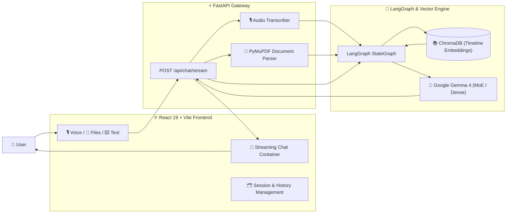

<div align="center">

# 🚀 VIBEWRITE (PersonaTwin.AI)

### Timeline-Grounded AI Persona & Conversational Digital Twin

#### An interactive, multimodal AI digital twin engine grounded in real-world post history and timelines using Retrieval-Augmented Generation (RAG), LangGraph, and Google Gemma 4.

<p>

[]()
[]()
[]()
[]()
[]()
[]()
[]()
[](LICENSE)

</p>

---

### ⚡ Timeline Grounding • Voice-First • Multimodal Document Ingestion • Real-Time SSE Streaming

[Features](#-features) •
[System Architecture](#-system-architecture) •
[Tech Stack](#-tech-stack) •
[Quickstart](#-quickstart-guide) •
[Configuration](#-configuration) •
[API Reference](#-api-reference)

</div>

---

# 📑 Table of Contents

- [Project Overview](#-project-overview)
- [Core Features](#-features)
- [System Architecture](#-system-architecture)
- [How It Works](#-how-it-works)
  - [Timeline Vector Ingestion](#1-timeline-vector-ingestion)
  - [LangGraph Retrieval Pipeline](#2-langgraph-retrieval-pipeline)
  - [Model Routing & Generation](#3-model-routing--generation)
  - [Real-Time SSE Streaming](#4-real-time-sse-streaming)
- [Tech Stack](#-tech-stack)
- [Repository Structure](#-repository-structure)
- [Quickstart Guide](#-quickstart-guide)
  - [Prerequisites](#prerequisites)
  - [Backend Setup](#backend-setup)
  - [Frontend Setup](#frontend-setup)
- [Configuration](#-configuration)
- [API Reference](#-api-reference)
- [License](#-license)

---

# 📖 Project Overview

**VIBEWRITE (PersonaTwin.AI)** is a real-time conversational AI system designed to faithfully replicate the voice, tone, opinions, and technical reasoning of persona digital twins—grounding responses in their actual timeline history and public posts rather than unverified hallucinations.

By combining dense vector retrieval with structured graph orchestration and modern large language models, VIBEWRITE enables users to interact naturally via text, voice, and document uploads while ensuring responses remain anchored to authentic source statements.

### Key Highlights:
- **Factually Grounded Persona**: Retrieves authentic timeline posts and statements before crafting replies.
- **Multimodal Interactions**: Record voice queries from the browser, drag-and-drop reference files (PDF, TXT, MD, CSV), or type standard prompts.
- **Real-Time Token Streaming**: Streams generated tokens via Server-Sent Events (SSE) for instant feedback.
- **Dynamic Multi-Session Chat**: Support for pinned chats, session renaming, message editing, branch regeneration, and local text-to-speech.

---

# ✨ Features

### 👤 Interactive User Experience
- **🎙️ Voice-First Input**: Record audio directly in-browser with automatic transcription through Whisper / multimodal STT.
- **📄 Multimodal Document Attachment**: Upload PDFs, TXTs, or markdown notes to provide ad-hoc context alongside queries.
- **⚡ Fluid Token Streaming**: Real-time response streaming with Markdown and code syntax highlighting.
- **✏️ Message Editing & Branching**: Edit previous user turns to fork conversations and regenerate responses.
- **📌 Multi-Chat Management**: Pin favorite sessions, rename topics, search history, and sort by recent activity.
- **🔊 Read Aloud (TTS)**: Built-in browser speech synthesis to listen to replies hands-free.

### 🧠 AI & Engineering Capabilities
- **Semantic Vector Search**: High-dimensional embeddings with `BAAI/bge-base-en-v1.5` over ChromaDB collections.
- **LangGraph State Orchestration**: Modular graph workflow isolating retrieval, state checkpoints, and generation.
- **Model Router**: Dynamic switching between **Gemma 4 26B MoE** and **Gemma 4 31B Dense** models.
- **FastAPI Async Gateway**: High-throughput asynchronous backend designed with clean boundary separation.

---

# 🏗 System Architecture



---

# 🔍 How It Works

### 1. Timeline Vector Ingestion
Historical posts and timeline data (`all_musk_posts.csv`) are filtered, indexed, and embedded using `BAAI/bge-base-en-v1.5`. Chunks preserve engagement metrics (likes, retweets, timestamps) in vector metadata for rich prompt grounding.

```bash
python backend/scripts/ingest_tweets.py
```

### 2. LangGraph Retrieval Pipeline
Incoming queries pass into a compiled LangGraph workflow:
1. **Query Ingestion**: Normalizes user text and any transcribed voice input.
2. **Context Retrieval**: Performs cosine similarity search against ChromaDB collections (`n_results=10`).
3. **Prompt Injection**: Formats retrieved posts with timestamps and engagement context into a specialized system prompt.

### 3. Model Routing & Generation
The backend supports flexible model selection via Google GenAI SDK:
- `Gemma 4 26B MoE` (`gemma-4-26b-a4b-it`)
- `Gemma 4 31B Dense` (`gemma-4-31b-it`)

### 4. Real-Time SSE Streaming
Responses are streamed incrementally over HTTP using Server-Sent Events (`text/event-stream`), delivering low latency and immediate UI updates.

---

# 🛠 Tech Stack

| Domain | Technology | Description |
|---|---|---|
| **Frontend** | React 19, Vite, Tailwind CSS | High-performance interactive UI with Lucide icons |
| **Backend** | FastAPI, Uvicorn | Async Python API gateway with CORS and multipart support |
| **Orchestration** | LangGraph, LangChain | Stateful graph execution and conversation checkpoints |
| **Vector DB** | ChromaDB | Persistent local vector store for semantic timeline search |
| **Embeddings** | SentenceTransformers (`BAAI/bge-base-en-v1.5`) | Dense text embeddings |
| **LLM Engine** | Google Gemma 4 / Gemini API | Advanced reasoning and grounded generation |
| **Speech** | Web MediaRecorder API, Whisper STT | Browser-native voice capture and audio transcription |

---

# 📁 Repository Structure

```text
VIBEWRITE/
├── backend/
│   ├── api/
│   │   └── routes/
│   │       └── chat.py          # Streaming chat and audio endpoints
│   ├── core/
│   │   └── config.py            # Application settings and environment config
│   ├── scripts/
│   │   ├── ingest_tweets.py     # Script to embed timeline posts into ChromaDB
│   │   └── ingest_docs.py       # Document ingestion utilities
│   ├── services/
│   │   ├── audio_engine.py      # Audio transcription and processing
│   │   └── rag_engine.py        # LangGraph workflow, ChromaDB & LLM stream
│   ├── main.py                  # FastAPI application entry point
│   ├── requirements.txt         # Python backend dependencies
│   └── .env.example             # Template for API keys and configuration
├── frontend/
│   ├── src/
│   │   ├── components/
│   │   │   ├── ChatContainer.jsx  # Primary chat interface & message list
│   │   │   ├── MessageInput.jsx   # Input bar with voice & file attachment
│   │   │   └── Sidebar.jsx        # Multi-chat sessions and pinned list
│   │   ├── App.jsx              # Main React application shell
│   │   └── index.css            # Tailwind styling rules
│   ├── package.json             # Node dependencies and scripts
│   └── vite.config.js           # Vite build configuration
├── docs/                        # Development logs and verification playbooks
├── test_bot.py                  # CLI test script for terminal RAG streaming
└── README.md                    # Project documentation
```

---

# 🚀 Quickstart Guide

### Prerequisites
- **Python 3.10+**
- **Node.js 18+** & `npm`
- **Gemini / Google AI API Key**

---

### Backend Setup

1. Navigate to the backend directory:
   ```bash
   cd backend
   ```

2. Create and activate a virtual environment:
   ```bash
   python -m venv venv
   # Windows:
   .\venv\Scripts\activate
   # Linux / macOS:
   source venv/bin/activate
   ```

3. Install dependencies:
   ```bash
   pip install -r requirements.txt
   ```

4. Configure environment variables:
   ```bash
   cp .env.example .env
   ```
   Add your `GEMINI_API_KEY` to `backend/.env`.

5. *(Optional)* Ingest or update timeline data into ChromaDB:
   ```bash
   python scripts/ingest_tweets.py
   ```

6. Start the FastAPI development server:
   ```bash
   python -m uvicorn main:app --host 127.0.0.1 --port 8000 --reload
   ```
   Backend will be running at `http://127.0.0.1:8000` (Docs: `http://127.0.0.1:8000/docs`).

---

### Frontend Setup

1. Open a new terminal and navigate to the frontend directory:
   ```bash
   cd frontend
   ```

2. Install Node packages:
   ```bash
   npm install
   ```

3. Start the Vite development server:
   ```bash
   npm run dev
   ```

4. Open `http://localhost:5173` in your browser to interact with VIBEWRITE!

---

# ⚙️ Configuration

Create a `.env` file in `backend/` with the following variables:

```env
# Google GenAI / Gemini API Key
GEMINI_API_KEY=your_gemini_api_key_here

# Application Configuration
APP_NAME=PersonaTwin.AI
DEBUG=True
```

---

# 📡 API Reference

### `POST /api/chat/stream`
Handles multimodal conversation streaming using Server-Sent Events.

- **Content-Type**: `multipart/form-data`
- **Parameters**:
  - `text` *(string, optional)*: User prompt or message.
  - `chatId` *(string, required)*: Unique session identifier for memory checkpointing.
  - `model_requested` *(string, optional)*: Model choice (e.g., `Gemma 4 26B MoE`).
  - `files` *(binary list, optional)*: Audio recording (`.webm`, `.wav`) or document attachments (`.pdf`, `.txt`, `.md`).
- **Response**: `text/event-stream` containing sequential token chunks:
  ```text
  data: Hello
  data:  world!
  data: [DONE]
  ```

### `POST /api/transcribe`
Converts raw audio bytes into text.

- **Content-Type**: `multipart/form-data`
- **Parameters**: `file` (Audio file)
- **Response**: `{"text": "transcribed string"}`

---

# 📄 License

This project is licensed under the [BSD 3-Clause License](LICENSE).
